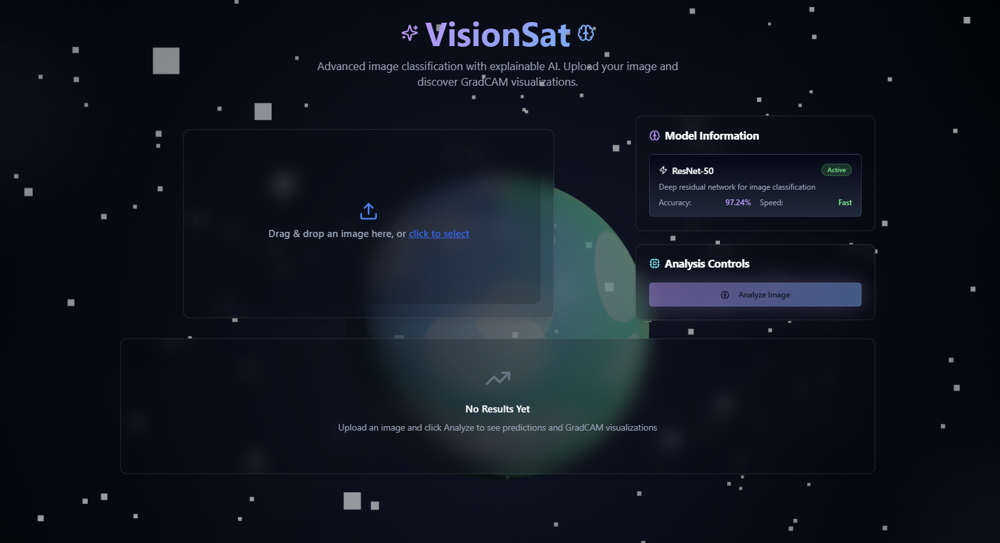

# 🌌 VisionSat – Explainable AI with Grad-CAM  

              


VisionSat is an **explainable AI web app** that lets you:  
- Upload an image 🖼️  
- Classify it using **PyTorch (ResNet-50 by default)** 🧠  
- Generate a **Grad-CAM heatmap** 🔥 to visually explain predictions  
- View results in a **modern React + TypeScript frontend** styled with **TailwindCSS + shadcn UI** 🎨  

---

## 🚀 Features
- ✅ Upload an image (JPEG/PNG).  
- ✅ Run classification with ResNet-50.  
- ✅ Explain predictions with **Grad-CAM visualization**.  
- ✅ Beautiful UI with **React + TailwindCSS + shadcn UI**.  
- ✅ **FastAPI backend** for model inference + Grad-CAM generation.  
- ✅ **Hugging Face Spaces** ready (Docker deployment).  

---

## 🛠️ Tech Stack
### Backend
- **Framework**: FastAPI  
- **Core file**: `main.py` → handles `/gradcam` API route.  
- **Grad-CAM logic**: `gradcam_utils.py` → generates heatmap.  
- **Response format**: JSON with:  
  ```json
  "predictions": [
    {"label": "residential", "score": 0.34},
    {"label": "sealeake", "score": 0.22},
    {"label": "highway", "score": 0.18},
    {"label": "industrial", "score": 0.08},
    {"label": "airport", "score": 0.05},
    {"label": "forest", "score": 0.04},
    {"label": "river", "score": 0.03},
    {"label": "farmland", "score": 0.02},
    {"label": "harbor", "score": 0.02},
    {"label": "railway", "score": 0.02}
  ],
  "gradcam": "data:image/png;base64,..." 

### Frontend

- **Framework**: React + TypeScript (Vite).
- **UI**: TailwindCSS + shadcn UI components.
- **Key Components**:
  - `ImageUpload.tsx` → File input + preview.
  - `ResultsDisplay.tsx` → Predictions + Grad-CAM heatmap.
  - `Index.tsx` → Main logic + API integration.
- **State Management**:
  - `selectedImage` → User uploaded image.
  - `gradcamImage` → Base64 Grad-CAM heatmap.
  - `predictions` → Model output.

---

## 📂 Project Structure
```bash
visionsat/
│── backend/
│   ├── main.py              # FastAPI backend
│   ├── gradcam_utils.py     # Grad-CAM logic
│   ├── requirements.txt     # Python dependencies
│
│── frontend/
│   ├── src/
│   │   ├── components/
│   │   │   ├── ImageUpload.tsx
│   │   │   ├── ResultsDisplay.tsx
│   │   ├── pages/
│   │   │   ├── Index.tsx
│   ├── package.json         # Frontend dependencies
│
│── Dockerfile
│── space.yaml               # Hugging Face Spaces config
│── README.md
```

## 📺 Demo Video
[](visionSat1.mp4)


---

## 🚀 Live Demo

You can try VisionSat directly here:  
👉 **[VisionSat](https://vision-sat.vercel.app)**  

---

## 👨‍💻 Authors

- **Ekaansh Sawaria**  
  📍 Manipal University Jaipur  
 

- **Abhinav Mishra**  
  📍 Manipal University Jaipur  
  
